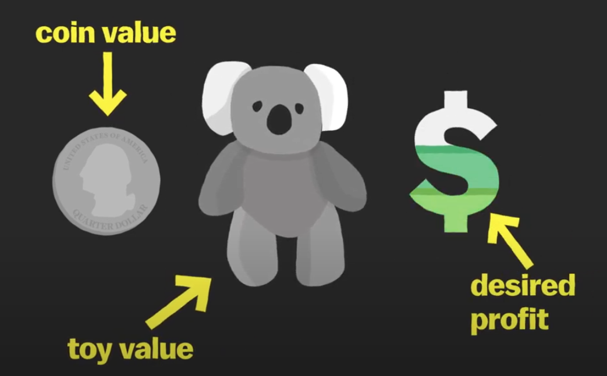

 Claw machines are rigged.

The machine takes as input the coin value, average value of a toy and the desired profit. The machine will automatically calculate when to send full strength to the claw.

For example, if it costs 0.50 dollars to play the game, and the prize inside costs 7 dollars, to make a profit of 50%, full power will be sent to the claw only about once every 21 games or so. They also randomize that winning game within a range so that players can't predict exactly when it will happen.

There is also something called the dropping skill. They can program the machine to make you  think you almost won. The machine picks up the toy, but then drops it.

The question of whether claw machines are a game of skill or chance goes back decades. During a crackdown on organized crime in the 1950s, federal law classified claw machines as gambling devices and prohibited the transportation of them across state lines. These laws were relaxed in the 1970s. There are regulations on how expensive the items inside the machine can be but no regulations on the settings that an owner can set to control the profits.